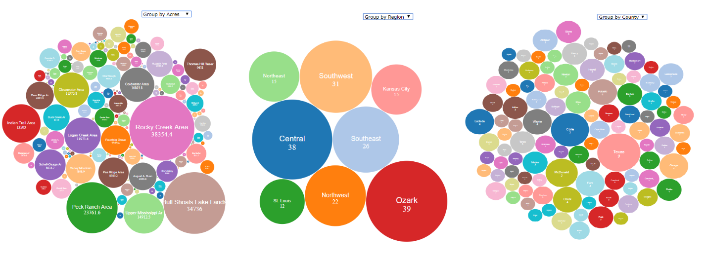
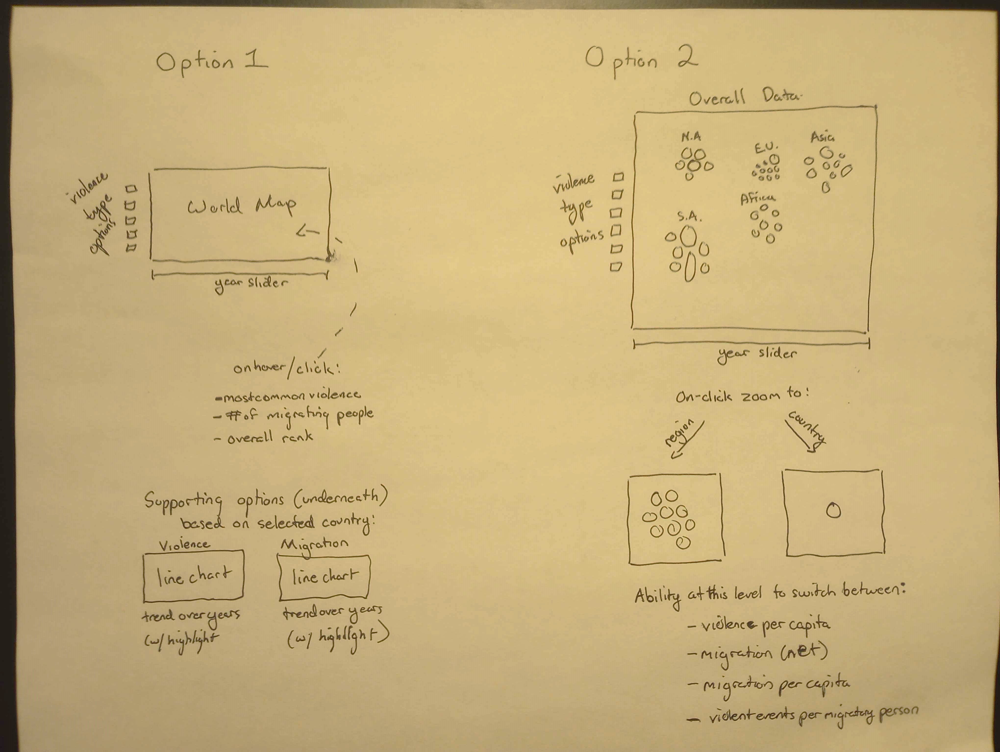

## Name: 

Paul Soltys

## Project: Conflict Migration

A closer look at how conflict and migration might be related over the 21st Century. Goal is to see if conflict might be driving migration of people and if so, where.

## Primary Sata Sources:

1. Records of violent events from the ACLED database, found at acleddata.com

Violent event reports of a wide variety to use as a method of understanding where violence might be most intense and what types of violence could be causing migration.

2. Records on the migration of people from the World Bank, found at databank.worldbank.org

Net migration numbers for countries and regions to properly estimate where people might be moving from as a result of violence.

## Visualization Options

1. Interactive Map. Goal would be to be able to use a slider to move the map across each year that is in the data, as well as click individual countries in order to garner some additional information about them.

https://votemaximizer.org/ the map here is relatively close to my envisioned idea. Selectors/sliders on the bottom or side, and then you can click each state (in my case, country) and it will zoom in or just provide hover-over information. (without the page switching or info dumps!)

2. Bubble Charts. Countries grouped by regions with size corresponding to net migration numbers. Regions could then be selected to zoom into all the countries in that region grouped in a similar way. Sliders/options on the side would cover years and violence types experienced by each region or country. 

 Showing group by certain variables (in my case, regional groupings)

There is also [https://vallandingham.me/bubble_chart/#] this chart which shows some interesting splitting mechanics that might be very, very useful in building an interesting chart out of this, although honestly I am uncertain how I would utilize it.

## Rough Sketches

## Ideal Option

Overall, I would say I am actually more interested in experimenting with what I can do in option 2- it seems like the more challenging & less classic of the two and I've built a fair number of regular maps in my time. The regional groupings and violent event groupings provided by each data source seem perfect for being split into sets of bubbles. The more classic map option is, for me, a fallback if for some reason bubble chart organization of this data is not up to standard or is not telling the story nearly as well as I would like. 

## Questions

1. I think my biggest theoretical question will be how & where I choose to implement options between violence, violence per capita, migration, migration per capita, and violence/migration as a combined metric. At what level to show those, or which ones might be most useful.

2. ACLED shows a lot of interesting things with different types of violence as seen in my static project, but I am concerned that including that here might be an issue of too much different information on the page. Or I might need to flip it as a sidebar option with the options listed in question 1 and only include the violence types in a deeper level.